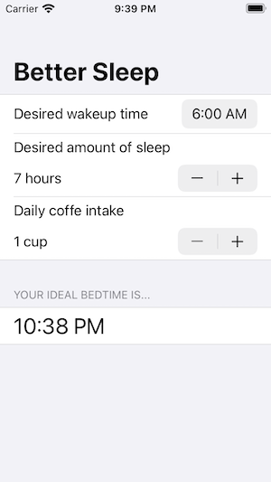

# Better_Rest
Project 4 tutorial from [100 Days of Swift](https://www.hackingwithswift.com/100/swiftui) from Hacking with Swift. The first ML tutorial of the project series.

* [Day 26 – Project 4, part one](https://www.hackingwithswift.com/100/swiftui/26)
* [Day 27 – Project 4, part two](https://www.hackingwithswift.com/100/swiftui/27)
* [Day 28 – Project 4, part three](https://www.hackingwithswift.com/100/swiftui/28)

Better Rest suggests the time when you should go to bed based on when you want to wake up, how many hours you want to sleep and the number of cups of coffee.

